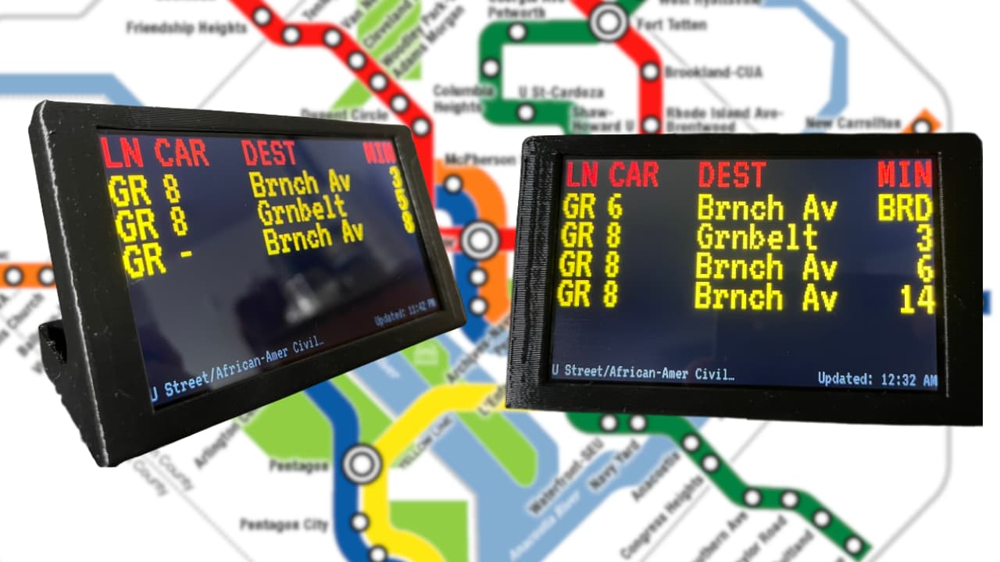

# WMATA Train Tracker


WMATA train tracking application is for monitoring train arrival times at your station of choice in Washington, DC. Built to run on the Raspberry Pi Zero 2 W.

The UI is built to closely resemble the Metro's "old" LED arrival boards.

Check it out in the browser at https://traintracking.nickleslie.dev/

## Table of Contents

- [Controls](#controls)
- [About](#about)
- [Setup on Device](#setup-on-device)
- [Technical Specifications](#technical-specifications)
  - [Nuxt 3](#nuxt-3)
  - [Wails](#wails)
- [Wails Development](#wails-development)
  - [Test](#test)
  - [Lint](#lint)
  - [SQL Generation](#sql-generation)
  - [Development](#development)
  - [Build](#build)
- [Frontend](#frontend)

## Controls

- **Set Your Station:** Tap/Click the left side of the screen.
- **View Incidents:** Tap/Click the right side.
- **Refresh Data:** Tap/Click the middle of the screen (UI updates automatically at regular intervals).

## About

This application is built to run on the [Raspberry Pi Zero 2 W](https://www.raspberrypi.com/products/raspberry-pi-zero-2-w/) (but could run on most other Raspberry Pis or devices) and the [Pimoroni HyperPixel 4.0 - Touch display](https://shop.pimoroni.com/products/hyperpixel-4?variant=12569485443155).
It can be housed in [this](https://cults3d.com/en/3d-model/gadget/enclosure-for-pimoroni-hyperpixel-4-0-rectangle-touch-and-raspberry-pi-zero) 3D printed enclosure.



If more devices are requested to be supported I will make my best effort to support them. Please add your requested devices in the issues.

## Setup on device

Check out [Raspberry Pi specific instructions](./documentation/raspberry-pi/README.md) on how to set it up on your devices.
This application can run in the browser or as a standalone application.

## Technical specifications

This application can run as a standalone [Wails](https://wails.io) application or in the browser with [Nuxt 3](https://nuxt.com/)

### Nuxt 3

Nuxt 3 provides a UI and API (Used by the Wails Application). It can be accessed by visiting https://traintracking.nickleslie.dev/.

For development instructions and more information on the Nuxt application, navigate to the [nuxt directory](./nuxt/).
The Nuxt application can be used as your preferred method of installing/running this application, if desired.
Instructions on how to set up a Raspberry Pi in Kiosk mode to display the Nuxt website can be found [here](./documentation/raspberry-pi/README.md#kiosk-mode-setup-for-browser)

### Wails

The Wails application provides an alternative way of running the application anywhere or on the Raspberry Pi.
Wails allows you to "Build desktop applications using Go & Web Technologies".

The Wails application is written with Go and utilizes the API exposed by the Nuxt 3 application. This allows for easier installation of the application without having to worry about API keys, etc.

Development instructions for the Wails/Go application can be found [here](#wails-development).

Instructions on how to set up a Raspberry Pi in Kiosk mode to run the Wails application can be found [here](./documentation/raspberry-pi/README.md#kiosk-mode-for-wails-application)

### Structure

This application has been set up as a monorepo with PNPM. This is to allow the Vue 3 components to be used by two applications along with other common TypeScript code.

- [.github](./.github) - Contains Github Actions for building the Wails application
- [app](./app/) - Contains Go-specific code used by the Wails application
- [build](./build/) - Output directory for the built Wails application. Currently contains the app icon
- [documentation](./documentation/) - Information on how to install the application on the Raspberry Pi
- [frontend](./frontend/) - Vue 3 code used by the Nuxt application and the Wails application
- [nuxt](./nuxt/) - A Nuxt 3 application providing a deployed UI that can be viewed in the browser and an API
- [shared](./shared/) - Shared TypeScript models and constants used between the Nuxt and Frontend application

## Wails Development

Install [Go](https://go.dev/) using the standard steps.
Next, install [Wails](https://wails.io) using the standard steps.

### Test

Tests can be run with the following command.

```BASH
go test ./...
```

or

```BASH
make test
```

### Lint

Linting is provided by [golangci-lint](https://golangci-lint.run/).

```BASH
golangci-lint run ./...
```

or

```BASH
make lint
```

### SQL Generation

This application uses SQLC for SQL code gen.
The SQL code can be found in the [app/db](./app/db/) directory.
The application makes use of a SQLite database for storage of some user values.

Ensure [SQLC is installed](https://docs.sqlc.dev/en/stable/overview/install.html) before continuing.

Use the following command to regenerate the required Go files.

```BASH
sqlc generate
```

or

```BASH
make sql-generate
```

### Development

Use the standard [Wails CLI](https://wails.io/docs/reference/cli#dev) commands for development

```BASH
wails dev
```

or

```BASH
make dev

make dev-no-bind # Without building frontend and bindings
```

### Build

Run the standard [Wails build CLI](https://wails.io/docs/reference/cli#build) command and navigate to the `build` directory to see the output.
Ensure the `config.cfg` file is located in the same directory as the executable. The application will fail to start otherwise.

```BASH
wails build
```

or

```BASH
make
```

## Frontend

The UI for this application is created using Vue 3. These components are found in the [frontend](./frontend/) directory. These components are also used by the Nuxt 3 application. This is to provided a consistent experience between the Wails and Nuxt application.
