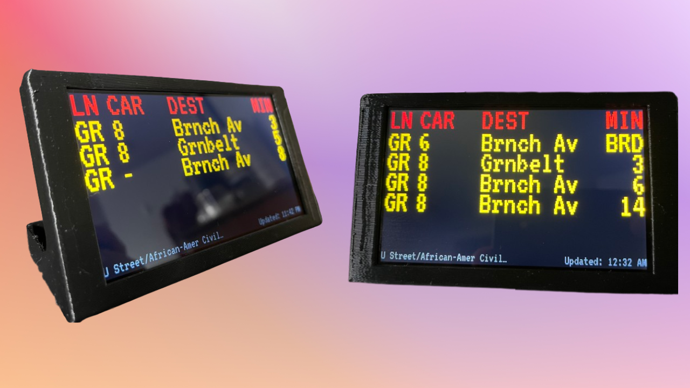

# DC Train Tracker


WMATA train tracking application for monitoring train arrival times at your station of choice. Built to run on the Raspberry Pi Zero 2 W

Check it out at https://wmata-train-tracking.vercel.app/.

Tap/Click the right side of the screen to set your station.

## About

This application is built to run on the [Raspberry Pi Zero 2 W](https://www.raspberrypi.com/products/raspberry-pi-zero-2-w/) (but could run on most other Raspberry Pis) and the [Pimoroni HyperPixel 4.0 - Touch display](https://shop.pimoroni.com/products/hyperpixel-4?variant=12569485443155).
It can be housed in [this](https://cults3d.com/en/3d-model/gadget/enclosure-for-pimoroni-hyperpixel-4-0-rectangle-touch-and-raspberry-pi-zero) 3D printed enclosure.



If more devices are requested to be supported I will make my best effort to support them. Please add your requested devices in the issues.

## Setup on device

Check out [Raspberry Pi specific instructions](./documentation/raspberry-pi/README.md) on how to set it up on your devices.

## Setup for local development

Check out the [.env.example](.env.example) for the required environment variables and create your own `.env` file at the root of the application.

The WMATA API key can be obtained from the [official WMATA API website](https://developer.wmata.com/).

Make sure to install the dependencies:

```bash
pnpm install
```

## Development Server

Start the development server on `http://localhost:3000`

```bash
pnpm run dev
```

## Production

Build the application for production:

```bash
pnpm run build
```

Locally preview production build:

```bash
pnpm run preview
```
