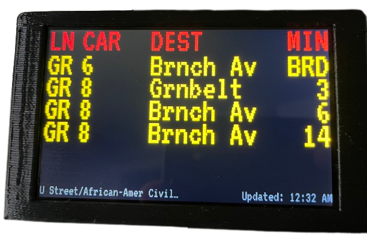
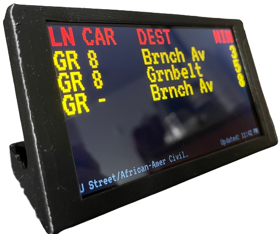

# Raspberry Pi Setup

This application is built to run on the [Raspberry Pi Zero 2 W](https://www.raspberrypi.com/products/raspberry-pi-zero-2-w/) (but could run on most other Raspberry Pis) and the [Pimoroni HyperPixel 4.0 - Touch display](https://shop.pimoroni.com/products/hyperpixel-4?variant=12569485443155).
It can be housed in [this](https://cults3d.com/en/3d-model/gadget/enclosure-for-pimoroni-hyperpixel-4-0-rectangle-touch-and-raspberry-pi-zero) 3D printed enclosure.




## Setup

Flash your SD Card with Raspberry Pi OS (currently tested on Bullseye 32-bit). This "should" have the HyperPixel 4.0 software already installed but check out the [Pimoroni GitHub](https://github.com/pimoroni/hyperpixel4/issues/177) for further details.

Set up the Raspberry Pi as you normally would and connect it to the internet. Plugging in an external display and keyboard may be the best approach.

### Pimoroni 4.0 Setup

Follow the guide on the [Pimoroni GitHub](https://github.com/pimoroni/hyperpixel4/issues/177) page for detailed steps.

I found adding the following to the `/boot/config.txt` file had the best results.

```
dtoverlay=vc4-kms-dpi-hyperpixel4
dtparam=rotate=270,touchscreen-swapped-x-y,touchscreen-inverted-x
```

Then create a new file,

```
sudo nano /usr/share/X11/xorg.conf.d/270-monitor.conf
```

with the following contents,

```
Section "Monitor"
    Identifier "DPI-1"
    Option "Rotate" "left"
EndSection
```

Courtesy of [jacyhung on the Pimoroni GitHub page](https://github.com/pimoroni/hyperpixel4/issues/177#issuecomment-1191037481).

### Kiosk Mode Setup for Browser

Based on the steps found [here](https://maker-tutorials.com/en/auto-start-midori-browser-in-fullscreen-kiosk-modus-raspberry-pi-linux/) we can set up the Raspberry Pi in "Kiosk Mode".

We will use [Midori Browser](https://astian.org/midori-browser-desktop/) since it has the best performance, on the Raspberry Pi Zero 2 W, of the browsers that I tested.

```
sudo apt-get update && sudo apt-get install -y midori matchbox unclutter
```

Create a starting script

```
nano start-midori.sh
```

And add the following content.
Further clarification on what each step does can be found at the [original source](https://maker-tutorials.com/en/auto-start-midori-browser-in-fullscreen-kiosk-modus-raspberry-pi-linux/)

```
#!/bin/sh
xset -dpms
xset s off
xset s noblank
unclutter &
matchbox-window-manager &
midori -e Fullscreen https://traintracking.nickleslie.dev/ # Change this if you are hosting it yourself
```

Test it by running `sudo xinit ./startMidori.sh`. If you run into issues then try `sudo xinit ./startMidori.sh -- :1`.

Add the script to the `rc.local` file by running `sudo nano /etc/rc.local` and adding the following,

```
sudo xinit /home/pi/start-midori.sh &
```

Run `sudo reboot` and you're done.

### Kiosk Mode for Wails Application

Instructions to come
